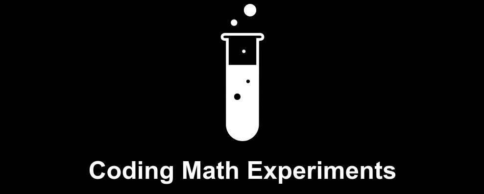

# Coding Math Experiments
> **Coding Math** Experiments based on the **Keith Peters**'s series on YouTube: http://www.youtube.com/user/codingmath, Updated to **ES6/ES7** with an interface to navigation.

## CodingMath
Keith Peters CodingMath Repository: https://github.com/bit101/CodingMath

Site: http://codingmath.com

YouTube: http://www.youtube.com/user/codingmath

Support: http://www.patreon.com/codingmath

## index
<li><a href="https://treedbox.github.io/codingmath/#0" target="_blank">00 angle</a></li>
<li><a href="https://treedbox.github.io/codingmath/#1" target="_blank">01 introduction</a></li>
<li><a href="https://treedbox.github.io/codingmath/#2" target="_blank">02 intro to trigonometry</a></li>
<li><a href="https://treedbox.github.io/codingmath/#3" target="_blank">03 more trigonometry</a></li>
<li><a href="https://treedbox.github.io/codingmath/#4" target="_blank">04 circles ellipses and lissajous curves bees</a></li>
<li><a href="https://treedbox.github.io/codingmath/#5" target="_blank">04 circles ellipses and lissajous curves circle</a></li>
<li><a href="https://treedbox.github.io/codingmath/#6" target="_blank">04 circles ellipses and lissajous curves matrix</a></li>
<li><a href="https://treedbox.github.io/codingmath/#7" target="_blank">04 circles ellipses and lissajous curves code</a></li>
<li><a href="https://treedbox.github.io/codingmath/#8" target="_blank">05 arctangent</a></li>
<li><a href="https://treedbox.github.io/codingmath/#9" target="_blank">07 vectors part 02</a></li>
<li><a href="https://treedbox.github.io/codingmath/#10" target="_blank">08 velocity</a></li>
<li><a href="https://treedbox.github.io/codingmath/#11" target="_blank">09 acceleration</a></li>
<li><a href="https://treedbox.github.io/codingmath/#12" target="_blank">09 acceleration fireworks</a></li>
<li><a href="https://treedbox.github.io/codingmath/#13" target="_blank">10 advanced acceleration</a></li>
<li><a href="https://treedbox.github.io/codingmath/#14" target="_blank">10 advanced acceleration ship1</a></li>
<li><a href="https://treedbox.github.io/codingmath/#15" target="_blank">10 advanced acceleration ship2</a></li>
<li><a href="https://treedbox.github.io/codingmath/#16" target="_blank">11 gravity</a></li>
<li><a href="https://treedbox.github.io/codingmath/#17" target="_blank">11 gravity orbit</a></li>
<li><a href="https://treedbox.github.io/codingmath/#18" target="_blank">12 edge handling bounce</a></li>
<li><a href="https://treedbox.github.io/codingmath/#19" target="_blank">12 edge handling regen</a></li>
<li><a href="https://treedbox.github.io/codingmath/#20" target="_blank">12 edge handling regen extra</a></li>
<li><a href="https://treedbox.github.io/codingmath/#21" target="_blank">12 edge handling removal</a></li>
<li><a href="https://treedbox.github.io/codingmath/#22" target="_blank">12 edge handling wrapping</a></li>
<li><a href="https://treedbox.github.io/codingmath/#23" target="_blank">13 friction friction1</a></li>
<li><a href="https://treedbox.github.io/codingmath/#24" target="_blank">13 friction friction2</a></li>
<li><a href="https://treedbox.github.io/codingmath/#25" target="_blank">13 friction ship2</a></li>
<li><a href="https://treedbox.github.io/codingmath/#26" target="_blank">14 collision detection rect rect</a></li>
<li><a href="https://treedbox.github.io/codingmath/#27" target="_blank">14 collision detection rect point</a></li>
<li><a href="https://treedbox.github.io/codingmath/#28" target="_blank">14 collision detection circle point</a></li>
<li><a href="https://treedbox.github.io/codingmath/#29" target="_blank">14 collision detection circle circle</a></li>
<li><a href="https://treedbox.github.io/codingmath/#30" target="_blank">15 springs part 01</a></li>
<li><a href="https://treedbox.github.io/codingmath/#31" target="_blank">16 springs part 02 spring1</a></li>
<li><a href="https://treedbox.github.io/codingmath/#32" target="_blank">16 springs part 02 spring2</a></li>
<li><a href="https://treedbox.github.io/codingmath/#33" target="_blank">17 particles optimization spring1</a></li>
<li><a href="https://treedbox.github.io/codingmath/#34" target="_blank">17 particles optimization orbit</a></li>
<li><a href="https://treedbox.github.io/codingmath/#35" target="_blank">18 particles enhancements</a></li>
<li><a href="https://treedbox.github.io/codingmath/#36" target="_blank">18 particles enhancements spring1</a></li>
<li><a href="https://treedbox.github.io/codingmath/#37" target="_blank">18 particles enhancements multigravity</a></li>
<li><a href="https://treedbox.github.io/codingmath/#38" target="_blank">19 bezier curves 01</a></li>
<li><a href="https://treedbox.github.io/codingmath/#39" target="_blank">19 bezier curves 02</a></li>
<li><a href="https://treedbox.github.io/codingmath/#40" target="_blank">19 bezier curves 03</a></li>
<li><a href="https://treedbox.github.io/codingmath/#41" target="_blank">19 bezier curves demo1</a></li>
<li><a href="https://treedbox.github.io/codingmath/#42" target="_blank">19 bezier curves demo2</a></li>
<li><a href="https://treedbox.github.io/codingmath/#43" target="_blank">19 bezier curves demo3</a></li>
<li><a href="https://treedbox.github.io/codingmath/#44" target="_blank">19 bezier curves demo4</a></li>
<li><a href="https://treedbox.github.io/codingmath/#45" target="_blank">19 bezier curves demo5</a></li>
<li><a href="https://treedbox.github.io/codingmath/#46" target="_blank">19 bezier curves demo6</a></li>
<li><a href="https://treedbox.github.io/codingmath/#47" target="_blank">20 more on bezier curves 01</a></li>
<li><a href="https://treedbox.github.io/codingmath/#48" target="_blank">20 more on bezier curves 02</a></li>
<li><a href="https://treedbox.github.io/codingmath/#49" target="_blank">20 more on bezier curves 03</a></li>
<li><a href="https://treedbox.github.io/codingmath/#50" target="_blank">21 bitmap collision detection</a></li>
<li><a href="https://treedbox.github.io/codingmath/#51" target="_blank">22 3d postcards in space 01</a></li>
<li><a href="https://treedbox.github.io/codingmath/#52" target="_blank">22 3d postcards in space 02</a></li>
<li><a href="https://treedbox.github.io/codingmath/#53" target="_blank">22 3d postcards in space stars</a></li>
<li><a href="https://treedbox.github.io/codingmath/#54" target="_blank">22 3d postcards in space postcards</a></li>
<li><a href="https://treedbox.github.io/codingmath/#55" target="_blank">23 3d carousel final</a></li>
<li><a href="https://treedbox.github.io/codingmath/#56" target="_blank">23 3d carousel postcards</a></li>
<li><a href="https://treedbox.github.io/codingmath/#57" target="_blank">23 3d carousel spiral</a></li>
<li><a href="https://treedbox.github.io/codingmath/#58" target="_blank">23 3d carousel stars</a></li>
<li><a href="https://treedbox.github.io/codingmath/#59" target="_blank">24 3d points and lines</a></li>
<li><a href="https://treedbox.github.io/codingmath/#60" target="_blank">25 3d points and lines</a></li>
<li><a href="https://treedbox.github.io/codingmath/#61" target="_blank">26 2d and 3d coordinate rotation</a></li>
<li><a href="https://treedbox.github.io/codingmath/#62" target="_blank">26 2d and 3d coordinate rotation 2d</a></li>
<li><a href="https://treedbox.github.io/codingmath/#63" target="_blank">27 easing and tweening</a></li>
<li><a href="https://treedbox.github.io/codingmath/#64" target="_blank">28 more on easing</a></li>
<li><a href="https://treedbox.github.io/codingmath/#65" target="_blank">28 more on easing click</a></li>
<li><a href="https://treedbox.github.io/codingmath/#66" target="_blank">28 more on easing steering</a></li>
<li><a href="https://treedbox.github.io/codingmath/#67" target="_blank">28 more on easing string</a></li>
<li><a href="https://treedbox.github.io/codingmath/#68" target="_blank">29 tweening part 01</a></li>
<li><a href="https://treedbox.github.io/codingmath/#69" target="_blank">30 tweening part 02 tweenBasic</a></li>
<li><a href="https://treedbox.github.io/codingmath/#70" target="_blank">30 tweening part 02 tweenx</a></li>
<li><a href="https://treedbox.github.io/codingmath/#71" target="_blank">30 tweening part 02 tweenFull</a></li>
<li><a href="https://treedbox.github.io/codingmath/#72" target="_blank">32 line intersections part 01</a></li>
<li><a href="https://treedbox.github.io/codingmath/#73" target="_blank">32 line intersections part 01 interactive</a></li>
<li><a href="https://treedbox.github.io/codingmath/#74" target="_blank">33 line intersections part 02 parallel</a></li>
<li><a href="https://treedbox.github.io/codingmath/#75" target="_blank">33 line intersections part 02 interactive</a></li>
<li><a href="https://treedbox.github.io/codingmath/#76" target="_blank">34 line intersections part 03 shapes star</a></li>
<li><a href="https://treedbox.github.io/codingmath/#77" target="_blank">34 line intersections part 03 particles</a></li>
<li><a href="https://treedbox.github.io/codingmath/#78" target="_blank">35 intro to fractals twist</a></li>
<li><a href="https://treedbox.github.io/codingmath/#79" target="_blank">35 intro to fractals sierpinski</a></li>
<li><a href="https://treedbox.github.io/codingmath/#80" target="_blank">35 intro to fractals kochanimated</a></li>
<li><a href="https://treedbox.github.io/codingmath/#81" target="_blank">35 intro to fractals koch</a></li>
<li><a href="https://treedbox.github.io/codingmath/#82" target="_blank">36 verlet integration part 01</a></li>
<li><a href="https://treedbox.github.io/codingmath/#83" target="_blank">37 verlet integration part 02</a></li>
<li><a href="https://treedbox.github.io/codingmath/#84" target="_blank">38 verlet integration part 03</a></li>
<li><a href="https://treedbox.github.io/codingmath/#85" target="_blank">38 verlet integration part 03 image</a></li>
<li><a href="https://treedbox.github.io/codingmath/#86" target="_blank">38 verlet integration part 03 ragdoll</a></li>
<li><a href="https://treedbox.github.io/codingmath/#87" target="_blank">39 verlet integration part 04</a></li>
<li><a href="https://treedbox.github.io/codingmath/#88" target="_blank">39 verlet integration part 04 json</a></li>
<li><a href="https://treedbox.github.io/codingmath/#89" target="_blank">39 verlet integration part 04 json2</a></li>
<li><a href="https://treedbox.github.io/codingmath/#90" target="_blank">40 fractal trees</a></li>
<li><a href="https://treedbox.github.io/codingmath/#91" target="_blank">40 fractal trees pytree</a></li>
<li><a href="https://treedbox.github.io/codingmath/#92" target="_blank">40 fractal trees pytreeanim</a></li>
<li><a href="https://treedbox.github.io/codingmath/#93" target="_blank">40 fractal trees treeanim</a></li>
<li><a href="https://treedbox.github.io/codingmath/#94" target="_blank">41 isometric 3d part 01</a></li>
<li><a href="https://treedbox.github.io/codingmath/#95" target="_blank">41 isometric 3d part 01 math</a></li>
<li><a href="https://treedbox.github.io/codingmath/#96" target="_blank">42 isometric 3d part 02</a></li>
<li><a href="https://treedbox.github.io/codingmath/#97" target="_blank">43 kinematics part 01</a></li>
<li><a href="https://treedbox.github.io/codingmath/#98" target="_blank">43 kinematics part 01 preview</a></li>
<li><a href="https://treedbox.github.io/codingmath/#99" target="_blank">44 kinematics part 02</a></li>
<li><a href="https://treedbox.github.io/codingmath/#100" target="_blank">44 kinematics part 02 02</a></li>
<li><a href="https://treedbox.github.io/codingmath/#101" target="_blank">45 kinematics part 03</a></li>
<li><a href="https://treedbox.github.io/codingmath/#102" target="_blank">47 weighted random</a></li>
<li><a href="https://treedbox.github.io/codingmath/#103" target="_blank">49 matrix math part 02</a></li>
<li><a href="https://treedbox.github.io/codingmath/#104" target="_blank">50 ifs fractals iterate function system</a></li>
<li><a href="https://treedbox.github.io/codingmath/#105" target="_blank">50 ifs fractals iterate function system random</a></li>
<li><a href="https://treedbox.github.io/codingmath/#106" target="_blank">51 pseudo random number generators prngs part 01 middle square method</a></li>
<li><a href="https://treedbox.github.io/codingmath/#107" target="_blank">51 pseudo random number generators prngs part 01 linear congrumential generator glibc</a></li>
<li><a href="https://treedbox.github.io/codingmath/#108" target="_blank">51 pseudo random number generators prngs part 01 linear congrumential generator numerical recipes</a></li>
<li><a href="https://treedbox.github.io/codingmath/#109" target="_blank">52 pseudo random number generators prngs part 02</a></li>
<li><a href="https://treedbox.github.io/codingmath/#110" target="_blank">52 pseudo random number generators prngs part 02 cryptography</a></li>
<li><a href="https://treedbox.github.io/codingmath/#111" target="_blank">52 pseudo random number generators prngs part 02 random shapes</a></li>
<li><a href="https://treedbox.github.io/codingmath/#112" target="_blank">52 pseudo random number generators prngs part 02 random shapes 02</a></li>
<li><a href="https://treedbox.github.io/codingmath/#113" target="_blank">53 random circle packing</a></li>
<li><a href="https://treedbox.github.io/codingmath/#114" target="_blank">54 dot product</a></li>
<li><a href="https://treedbox.github.io/codingmath/#115" target="_blank">54 dot product angle</a></li>
<li><a href="https://treedbox.github.io/codingmath/#116" target="_blank">55 aspect ratio</a></li>
<li><a href="https://treedbox.github.io/codingmath/#117" target="_blank">56 box layout</a></li>
<li><a href="https://treedbox.github.io/codingmath/#118" target="_blank">57 grid layout</a></li>
<li><a href="https://treedbox.github.io/codingmath/#119" target="_blank">57 grid layout 02</a></li>
<li><a href="https://treedbox.github.io/codingmath/#120" target="_blank">57 grid layout strokes</a></li>
<li><a href="https://treedbox.github.io/codingmath/#121" target="_blank">57 grid layout circles</a></li>
<li><a href="https://treedbox.github.io/codingmath/#122" target="_blank">58 array math get color</a></li>
<li><a href="https://treedbox.github.io/codingmath/#123" target="_blank">58 array math node garden</a></li>
<li><a href="https://treedbox.github.io/codingmath/#124" target="_blank">mini 01</a></li>
<li><a href="https://treedbox.github.io/codingmath/#125" target="_blank">mini 02</a></li>
<li><a href="https://treedbox.github.io/codingmath/#126" target="_blank">mini 03</a></li>
<li><a href="https://treedbox.github.io/codingmath/#127" target="_blank">mini 04</a></li>
<li><a href="https://treedbox.github.io/codingmath/#128" target="_blank">mini 06</a></li>
<li><a href="https://treedbox.github.io/codingmath/#129" target="_blank">mini 07</a></li>
<li><a href="https://treedbox.github.io/codingmath/#130" target="_blank">mini 08</a></li>
<li><a href="https://treedbox.github.io/codingmath/#131" target="_blank">mini 08 test1</a></li>
<li><a href="https://treedbox.github.io/codingmath/#132" target="_blank">mini 08 test2</a></li>
<li><a href="https://treedbox.github.io/codingmath/#133" target="_blank">mini 09</a></li>
<li><a href="https://treedbox.github.io/codingmath/#134" target="_blank">mini 09 02</a></li>
<li><a href="https://treedbox.github.io/codingmath/#135" target="_blank">mini 09 03</a></li>
<li><a href="https://treedbox.github.io/codingmath/#136" target="_blank">mini 09 highres</a></li>
<li><a href="https://treedbox.github.io/codingmath/#137" target="_blank">mini 10</a></li>
<li><a href="https://treedbox.github.io/codingmath/#138" target="_blank">mini 10 02</a></li>
<li><a href="https://treedbox.github.io/codingmath/#139" target="_blank">mini 10 circle</a></li>
<li><a href="https://treedbox.github.io/codingmath/#140" target="_blank">mini 11</a></li>
<li><a href="https://treedbox.github.io/codingmath/#141" target="_blank">mini 11 bezier</a></li>
<li><a href="https://treedbox.github.io/codingmath/#142" target="_blank">application 01</a></li>
<li><a href="https://treedbox.github.io/codingmath/#143" target="_blank">application 02</a></li>
<li><a href="https://treedbox.github.io/codingmath/#144" target="_blank">application 02 02</a></li>
<li><a href="https://treedbox.github.io/codingmath/#145" target="_blank">application 03</a></li>
<li><a href="https://treedbox.github.io/codingmath/#146" target="_blank">application 03 02</a></li>
<li><a href="https://treedbox.github.io/codingmath/#147" target="_blank">application 04</a></li>

## Meta
#### [Jonimar Marques Policarpo / Treedbox](http://linkedin.com/treedbox 'LinkEdin')

I'm Full Stack Developer for 10+ years, JavaScript Expert, Front End Developer, UX/UI Designer, UI Developer and Product Manager:

Node.js, JavaScript (ES6, ES7, ES8), CSS3, HTML5, PHP, SVG.

Learning Ruby on Rails, Python (Django), C# for Unity and Go.

LinkEdin: [http://linkedin.com/treedbox](http://linkedin.com/treedbox)

Twitter: [@treedbox](http://twitter.com/treedbox)

E-mail: [treedbox@gmail.com](mailto:treedbox@gmail.com)

Site: [treedbox](http://treedbox.com)

## License
[MIT](LICENSE.md) © [TreedBox](https://github.com/treedbox)

[https://github.com/treedbox/codingmath](https://github.com/treedbox/codingmath)
